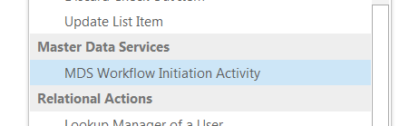

# Background
The business rules created in SQL Server Master Data Services can call external workflows, such as SharePoint site workflows. Without additional customization, this integration is only supported if MDS and SharePoint are installed in the same server.

##Update
This project was migrated from Codeplex and its being kept for reference purposes only.
 
# Project Description
This project consists of three components:

## 1 - [Web Service for Site Workflow activation](docs/Web-Service-for-Site-Workflow-activation.md)
A web service to be deployed to SharePoint server. This web service overcomes a limitation in SharePoint web services, which prevents site workflows to be initiated via web service calls. This component is independent from the others, and be used by other systems or solutions. Note: I don’t know if this limitation is still present in SharePoint 2013.

## 2 -  [Master Data Services workflow extender](docs/Master-Data-Services-workflow-extender.md)
A workflow extender, to be deployed to Master Data Services server. This workflow extender allows business rules to initiate SharePoint workflows located in a different server. It requires the component 1 to be deployed in the target SharePoint server.

Note that additional configuration is required in MDS to enable external workflows. More information [here](here)

## 3 - [SharePoint Designer Custom Workflow Action](docs/SharePoint-Designer-Custom-Workflow-Action.md)
A custom workflow action for SharePoint designer.

# About the author
**Half Scheidl**
IT Consultant with an international master’s degree in IT Management, specialized in Business Intelligence and Master Data Management. Based in Helsinki, Finland.
[http://fi.linkedin.com/in/scheidlh](http://fi.linkedin.com/in/scheidlh)
